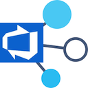

# azure-devops-board-parents

Fetch and display the parent of each item and also the remainings in Azure Devops Boards.

You can find it on the store here for easy install https://chrome.google.com/webstore/detail/parents-for-azure-devops/fbdbipdlfojffkpopckfpohmaiabglad

## Pre-requisites
 - In your board display settings, choose to display the ID of the work item on the card
 - Use the new azure devops url pattern (eg. https://dev.azure.com/org/....)

## How to use for development
 - Clone/Download the repository
 - Go to your chrome extensions page
 - Activate developer mode
 - Click load unpacked extension
 - Select the folder of the project you've cloned
 - Refresh the board page and click on the extension icon
 - If anything goes wrong at any time or it doesn't work, please just refresh the page and re-click on the extension icon

## Contributing
 - It is not all perfect, especially the way I retrigger rendering when devops rerender elements (which is ALL THE TIME ..) so if you see some issues and want to help, feel free to send pull requests
 - Please feel free to also raise any issues and i'll try my best to fix them
 - As much as possible if adding new feature, please create new background/inject scripts and include them in manifest

# Enjoy
